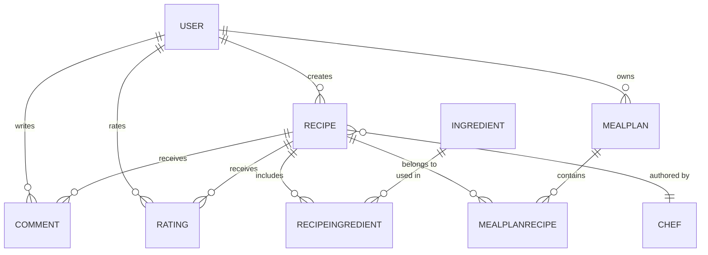

## Quickstart

First, clone this repository. Then:

- Install the .NET Entity Framework CLI
  * `dotnet tool install --global dotnet-ef`
- Create the database/s in `psql`
  * `CREATE DATABASE suechef_development;`
  * `CREATE DATABASE suechef_test;`
- Run the migration to create the tables
  * `cd` into `/SueChef`
  * `dotnet ef database update`
  * `DATABASE_NAME=suechef_development dotnet ef database update`
- Start the application, with the development database
  * `DATABASE_NAME=suechef_development dotnet watch run`
- Go to `http://localhost:5287/`

## Running the Tests

- Install playwright package
  * `dotnet add package Microsoft.Playwright`
- Install playwright browser
  * `pwsh bin/Debug/net9.0/playwright.ps1 install`
- Verify its installation
 * `dotnet list package`
- Start the application, with the default (test) database
  * `dotnet watch run`
- Open a second terminal session and run the tests
  * `dotnet test`

### Troubleshooting

If you see a popup about not being able to open Chromedriver...
- Go to **System Preferences > Security and Privacy > General**
- There should be another message about Chromedriver there
- If so, Click on **Allow Anyway**

## Updating the Database

Changes are applied to the database programatically, using files called _migrations_, which live in the `/Migrations` directory. The process is as follows...

- To update an existing table
  * For example, you might want to add a title to the `Post` model
  * In which case, you would add a new field there
- To create a new table
  * For example, you might want to add a table called Comments
  * First, create the `Comment` model
  * Then go to Project3DbContext
  * And add this `public DbSet<Comment>? Comments { get; set; }` 
- Generate the migration file
  * `cd` into `/Project3`
  * Decide what you wan to call the migration file
  * `AddTitleToPosts` or `CreateCommentsTable` would be good descriptive names
  * Then do `dotnet ef migrations add ` followed by the name you chose
  * E.g.  `dotnet ef migrations add AddTitleToPosts`
- Run the migration
  * `dotnet ef database update`

### Troubleshooting

#### Seeing `role "postgres" does not exist`?

Your application tries to connect to the database as a user called `postgres`, which is normally created automatically when you install PostgresQL. If the `postgres` user doesn't exist, you'll see `role "postgres" does not exist`.

To fix it, you'll need to create the `postgres` user.

Try this in your terminal...

```
; createuser -s postgres
```

If you see `command not found: createuser`, start a new `psql` session and do this...

```sql
create user postgres;
```

#### Want to Change an Existing Migration?

Don't edit the migration files after they've been applied / run. If you do that, it'll probably lead to problems. If you decide that the migration you just applied wasn't quite right for some reason, you have two options

- Create and run another migration (using the process above)

OR...

- Rollback / undo the last migration
- Then edit the migration file before re-running it

How do you rollbacl a migration? Let's assume that you have two migrations, both of which have been applied.

1. CreatePostsAndUsers
2. AddTitleToPosts

To rollback the second, you again use `dotnet ef database update` but this time adding the name of the last 'good' migration. In this case, that would be `CreatePostsAndUsers`. So the command is...

```shell
; dotnet ef database update CreatePostsAndUsers
```

# 👨‍🍳 SueChef

---

## 📘 Project Overview

SueChef is a dynamic full-stack web application that allows users to browse and comment on recipes, rate dishes, create meal plans, and automatically generate shopping lists.  
It expands on the functionality of traditional recipe sites like BBC Good Food by integrating **nutrition tracking**, **serving-size scaling**, and **personalised meal planning** tools.  

This project was developed using **ASP.NET Core MVC**, **Entity Framework Core**, and **PostgreSQL**, styled with **Tailwind CSS**, and supported by **modular JavaScript** for interactivity.  
SueChef offers a responsive, accessible experience and a modern MVC-based architecture.

---

## ⚙️ Tech Stack

- **ASP.NET Core MVC (.NET 8)**
- **Entity Framework Core**
- **PostgreSQL**
- **Razor Views (Tailwind CSS)**
- **JavaScript (modular scripts)**
- **xUnit (Testing)**
- **DotNetEnv (Environment Management)**
- **Google OAuth + Session Authentication**

---

## 📁 Project Structure

| Folder | Description |
|--------|--------------|
| `/Controllers` | Request handling and route logic |
| `/Models` | Database entities and EF Core schemas |
| `/Views` | Razor pages and UI rendering |
| `/ViewModels` | Data transfer and view binding models |
| `/wwwroot` | Static files (CSS, JS, images) |
| `/Data` | EF Core DbContext and migrations |
| `/ActionFilters` | Session authentication filter |

---

## 🧩 Architecture & Design

### 2.1 Overview

SueChef follows the **Model–View–Controller (MVC)** pattern using ASP.NET Core.  
This promotes separation of concerns, scalability, and maintainability.

- **Model:** Defines application data and EF Core relationships.  
- **View:** Razor templates that dynamically render HTML and Tailwind styling.  
- **Controller:** Handles routes, processes requests, and connects models to views.

### 2.2 Request Flow

```
[Browser] → [Controller] → [Model/DbContext] → [Controller] → [View] → [Browser]
```

### 2.3 Application Layers

| Layer | Purpose | Example Files |
|--------|----------|----------------|
| **Model** | Defines schema, validation, and logic | `UserModel.cs`, `RecipeModel.cs`, `MealPlanModel.cs` |
| **View** | Renders Razor pages with Tailwind UI | `_Layout.cshtml`, `RecipeDetails/Index.cshtml` |
| **Controller** | Routes and handles logic | `MealPlanController.cs`, `RecipeDetailsController.cs` |
| **Database Context** | EF Core ORM bridge | `SueChefDbContext.cs` |

### 2.4 Design Principles

- **Entity Framework Core** for ORM and migrations  
- **Tailwind CSS** for clean, responsive UI  
- **Session-based authentication** for simplicity and security  
- **Custom Action Filter** for route protection (`AuthenticationFilter.cs`)  
- **Reusable ViewModels** for componentised front-end rendering  

---

## 🍽️ Database Design

### 3.1 Overview

SueChef uses **Entity Framework Core** with PostgreSQL to manage its relational schema.  
The schema captures relationships between users, recipes, ingredients, comments, and meal plans.

### 3.2 Entity Summary

| Entity | Description |
|--------|--------------|
| **User** | Stores user credentials and links to recipes, comments, and ratings |
| **Chef** | Represents authors of recipes |
| **Recipe** | Core entity containing cooking instructions, nutritional data, and relationships |
| **Ingredient** | Tracks macro values and measurement units |
| **RecipeIngredient** | Join table linking recipes and ingredients |
| **Comment** | Stores user comments on recipes |
| **Rating** | Represents a user’s rating for a recipe |
| **MealPlan** | User-created collection of recipes with soft-delete functionality |
| **MealPlanRecipe** | Links recipes to meal plans |

### 3.3 Relationships

| Relationship | Type | Description |
|--------------|------|-------------|
| User → Recipe | One-to-Many | A user can create multiple recipes |
| User → Comment | One-to-Many | A user can write multiple comments |
| User → Rating | One-to-Many | A user can rate multiple recipes |
| Recipe → Ingredient | Many-to-Many | Recipes include many ingredients |
| Recipe → Comment | One-to-Many | A recipe can have multiple comments |
| Recipe → Rating | One-to-Many | A recipe can have multiple ratings |
| MealPlan → Recipe | Many-to-Many | A meal plan contains multiple recipes |

### 3.4 ER Diagram



---

## 🎮 Controllers

### 4.1 Overview

SueChef’s controllers act as the bridge between frontend requests and backend logic.  
They manage recipe browsing, meal plan creation, authentication, and commenting.

### 4.2 Controller Summary

| Controller | Description |
|-------------|-------------|
| **HomeController** | Renders homepage and category carousels. |
| **RecipeDetailsController** | Displays recipe details, comments, and ratings. |
| **CategoriesController** | Filters recipes by difficulty, dietary type, or popularity. |
| **MealPlanController** | Manages CRUD operations for meal plans and recipe additions. |
| **UsersController** | Handles registration and Google OAuth authentication. |
| **SessionsController** | Manages login and logout via session storage. |
| **CommentsController** | Allows users to post comments on recipes. |

### 4.3 Design Patterns

- **Session Context** – Tracks logged-in user state.  
- **Service Filters** – `[ServiceFilter(typeof(AuthenticationFilter))]` guards routes.  
- **LINQ with EF Core** – Efficient data access with eager loading.  
- **Redirect Flow** – `RedirectToAction()` refreshes views after updates.

---

## 🖥️ Frontend / Views

### 5.1 Overview

SueChef’s frontend is built with **Razor Views** and **Tailwind CSS**, using modular partials for maintainability.

### 5.2 Page Views

| View | Description |
|------|--------------|
| **Home/Index.cshtml** | Displays featured recipes and carousels |
| **Categories/Index.cshtml** | Lists recipes by filter category |
| **RecipeDetails/Index.cshtml** | Shows recipe details, nutrition, and comments |
| **MealPlan/Index.cshtml** | Displays user meal plans |
| **MealPlan/Show.cshtml** | Renders a single meal plan |
| **Sessions/New.cshtml** | User sign-in page |
| **Users/New.cshtml** | Registration page |
| **Home/Privacy.cshtml** | Privacy policy view |

### 5.3 Shared Layouts

- `_Layout.cshtml` – Global layout, navigation, and footer  
- `_RecipeCardVerticalPartial.cshtml` / `_RecipeCardHorizontalPartial.cshtml` – Recipe displays  
- `_CategoryCarouselPartial.cshtml` – Category navigation UI  
- `_MealPlanPartial.cshtml` / `_MealPlanRecipeCardPartial.cshtml` – Meal plan displays  
- `_FeaturedRecipePartial.cshtml` – Homepage feature banner  
- `_ValidationScriptsPartial.cshtml` – Client-side validation  
- `Error.cshtml` – Application error page  

---

## 🧠 JavaScript

SueChef’s interactivity is powered by modular scripts located in `/wwwroot/js`.

| Script | Function |
|---------|-----------|
| `navbar.js` | Toggles search bar, mobile nav, and overlay drawers |
| `recipeDetails.js` | Handles ingredient/nutrition toggling and serving scaling |
| `carousel.js` | Infinite looping recipe carousels |
| `homepagemealplanbutton.js` | Toggles “Add to Meal Plan” button visuals |
| `backtotopbutton.js` | Smooth scroll back-to-top functionality |
| `site.js` | Placeholder for general scripts |

---

## 🧪 Testing

SueChef uses **xUnit** for unit testing and supports integration testing through Playwright (optional).

| Framework | Purpose |
|------------|----------|
| **xUnit** | Unit and integration tests |
| **Playwright** | E2E testing (planned) |

**Example Test Files:**  
`MealPlanController.Tests.cs`, `UserAuthentication.Tests.cs`, `RecipeDetails.Tests.cs`

---

## 🚀 Future Implementations

- Automatic shopping list generation from meal plans  
- Recipe submission and approval workflow  
- Profile pages with saved recipes  
- Admin dashboard for moderation  
- REST API for mobile app integration  

---

## 🙏 Acknowledgements & Documentation

| Technology | Documentation | Purpose |
|-------------|----------------|----------|
| ASP.NET Core MVC | [ASP.NET Core MVC Overview](https://learn.microsoft.com/en-us/aspnet/core/mvc/overview?view=aspnetcore-9.0) | Framework for controllers & routing |
| Entity Framework Core | [EF Core Docs](https://learn.microsoft.com/en-us/ef/core/) | ORM and migrations |
| Razor Views | [Razor Syntax Reference](https://learn.microsoft.com/en-us/aspnet/core/mvc/views/razor?view=aspnetcore-9.0) | Template rendering |
| Tailwind CSS | [Tailwind Docs](https://tailwindcss.com/docs) | CSS utility framework |
| Google OAuth | [Google Identity Docs](https://developers.google.com/identity) | Third-party authentication |
| xUnit | [xUnit Docs](https://xunit.net/) | Testing framework |
| Playwright | [Playwright Docs](https://playwright.dev/dotnet/docs/intro) | Browser automation |
| .NET CLI | [.NET CLI Docs](https://learn.microsoft.com/en-us/dotnet/core/tools/) | Build and run commands |
| LINQ | [LINQ Docs](https://learn.microsoft.com/en-us/dotnet/csharp/linq/) | Data querying |
| C# Language | [C# Reference](https://learn.microsoft.com/en-us/dotnet/csharp/language-reference/) | Language documentation |

---

## 🧭 Summary of Documentation

| Category | Documentation | Use Case |
|-----------|----------------|----------|
| Core Framework | ASP.NET Core MVC | Controllers, routing, and views |
| Database | Entity Framework Core | Data relationships and migrations |
| Frontend | Tailwind CSS + Razor | Styling and templates |
| Authentication | ASP.NET Sessions + Google OAuth | User login and management |
| Testing | xUnit + Playwright | Testing coverage |
| Deployment | .NET CLI | Build automation and hosting |
| Language | C# + LINQ | Syntax and data logic |

---

## 🧾 License

This project is released under the MIT License.


